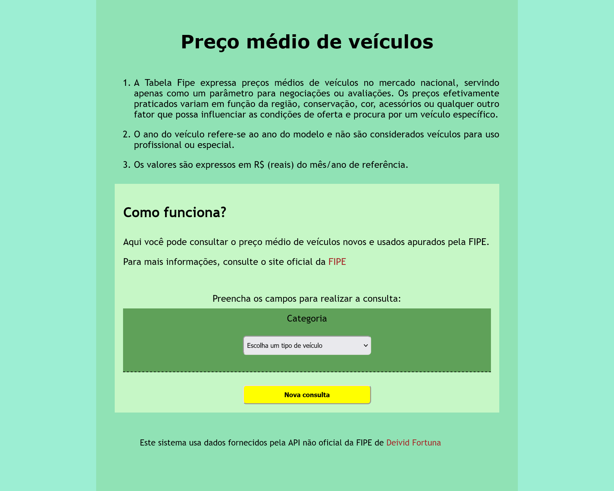
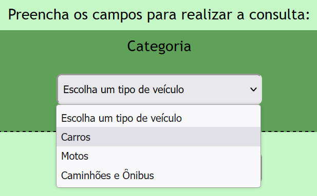
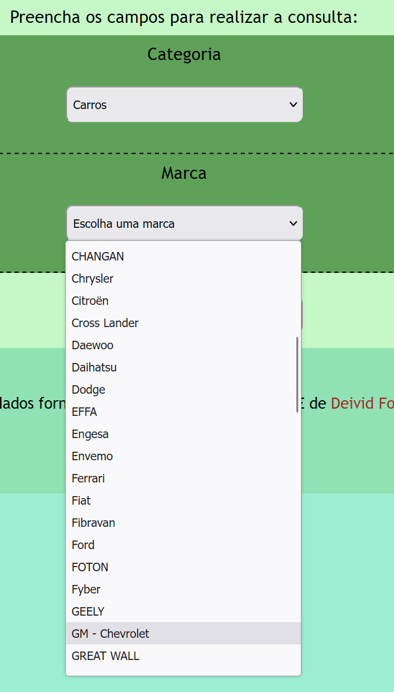
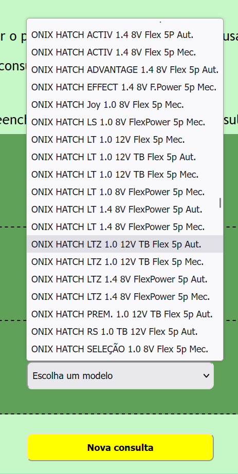
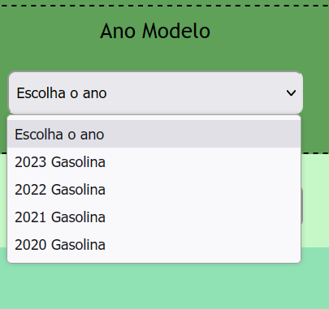
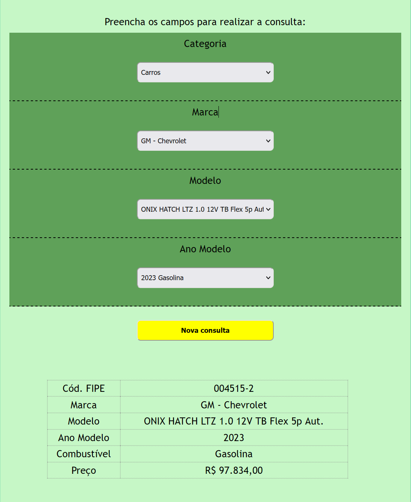

<h1>FIPE - Preço de veículos usados</h1>

O sistema tem por finalidade consultar o preço médio de veículos com base nos dados da Tabela FIPE.
 

Os dados são fornecidos pela <a href="https://github.com/deividfortuna/fipe" target="blank">API</a> não oficial da FIPE.

O projeto tem propósitos academicos, em especial com relação ao consumo de dados de uma API REST utilizando ReactJS.

A tela inicial do sistema:

Para realizar a consulta o usuário deve escolher uma categoria, que quando selecionada carregará as marcas de veículos disponíveis para aquela categoria.

Selecionada a categoria, o sistema carregará as marcas de veículos disponíveis para aquela categoria.

Ao escolher uma marca, o sistema carregará os modelos de veículos existentes para àquela marca

Ao escolher um modelo, o sistema carregará os anos de lançamento daquele modelo

Ao escolher o ano veículo, o sistema encontrará o veículo que preenche todos os parâmetros e entregará seu preço médio praticado no mercado de usados, de acordo com a Tabela FIPE.

<h2>Considerações Finais</h2>

Esse projeto serviu-me para aprimorar noções de componentização, bem como vivenciar desafios e buscar soluções em relação ao consumo de dados em formato JSON e sua disponibilização, considerando restrições de acesso (CORS).
